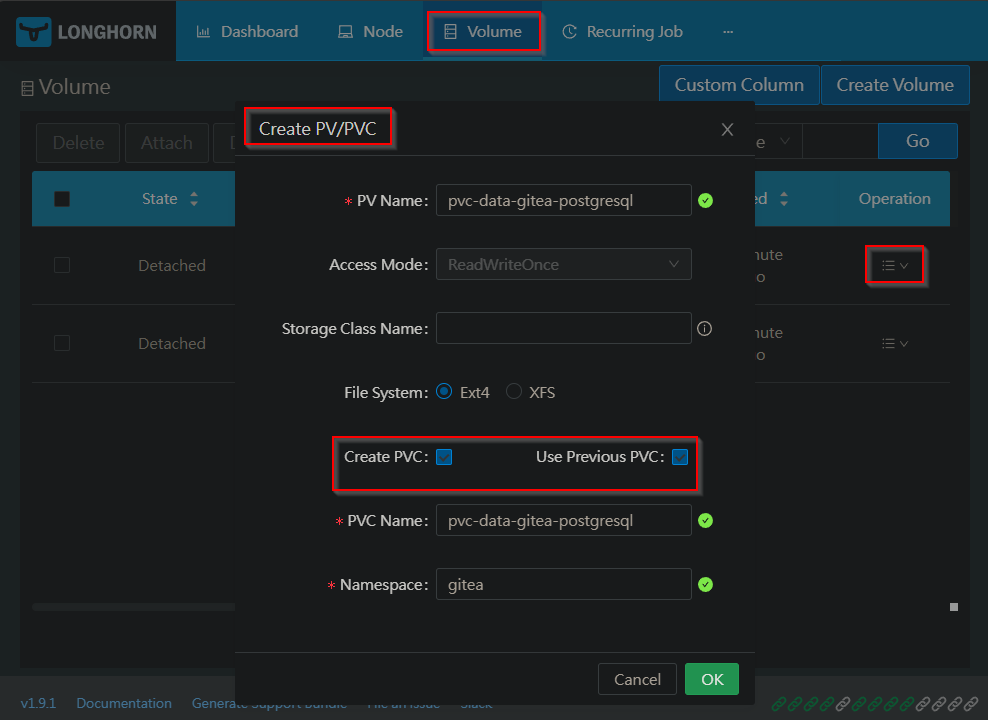

# Bootstrap Tool

Helm chart for initial install, cluster migration, or disaster recovery (DR).

Setting up a GitOps Kubernetes environment has a chicken-and-egg problem: how can applications be redeployed without existing CD infrastructure? The approach taken here is to restore the bare minimum for deployments - ArgoCD, Gitea, and Longhorn - and restore the remainder of the cluster from remote backups.

## Usage

### Prerequisites 

* Cluster nodes and environment
    * Hardware capable of running k3s, ideally with 3 server nodes
    * Control of domain name, DDNS, routing, and DNS set up to route traffic to the cluster
    * See [k3s-ansible docs](https://github.com/k3s-io/k3s-ansible?tab=readme-ov-file#build-a-kubernetes-cluster-using-k3s-via-ansible) for OS and CPU architecture requirements
* For a new install:
    * A backblaze bucket set up for Longhorn backups
* For disaster recovery:
    * Backup restore credentials and URL
    * Gitea admin credentials

### Flow

The bootstrap process follows this order:

1. K3s is deployed using ansible
1. ArgoCD is installed using Argo's Helm chart
1. Longhorn and Gitea are deployed as ArgoCD application manifests defined by the Helm chart in this directory

The remaining steps will vary depending on if backups are available

* For disaster recovery, application volumes are restored from backups
* For first time setup, the Gitea and vaultwarden volumes are created and configured 

### Installation 

1. Install k3s using `k3s-ansbile`. Follow the [k3s-ansbile docs](https://github.com/k3s-io/k3s-ansible) for full instructions
    * Clone the `k3s-ansible` repo
    * Set up `inventory.yml`. I had to add some extra args:
        ```yaml
        k3s_cluster:
          children:
            server:
              hosts:
                node1.mydomain.tld:
                  extra_server_args: "--tls-san node1.mydomain.tld --disable=local-storage"
                node2.mydomain.tld:
                  extra_server_args: "--tls-san node2.mydomain.tld --disable=local-storage"
                node3.mydomain.tld:
                  extra_server_args: "--tls-san node3.mydomain.tld --disable=local-storage"
        ```
    * Add sudo passwords to vaults in the `host_vars` directory. Repeat for each node
        ```yaml
        mkdir host_vars/node1.yourdomain.tld
        ansible-vault create host_vars/node1.yourdomain.tld/vault.yml
        # Use the same password for all vaults
        # Add this line:
        # ansible_become_password: your-node-1-password-here
        ```
    * Create Kubernetes token and store it in an `ansible-vault` and run the `site` playbook
        ```sh 
        ansible-vault create vault-globals.yml
        ansible-vault edit vault-globals.yml 
        # Add `k3s_token: theTokenHere` to the vault, see inventory.yml for how to generate
        ```
    * Run the `site` playbook
        ```sh
        ansible-playbook -i inventory.yml playbooks/site.yml --ask-vault-pass -e @vault-globals.yml
        ```
1. Install ArgoCD on the cluster with Helm
    ```sh
    helm repo add argo https://argoproj.github.io/argo-helm
    helm repo update
    helm upgrade --install argocd argo/argo-cd --version 8.1.3 -n argocd --create-namespace
    ```
1. Clone this repo and `cd` to the root
1. Copy the bootstrap values file. Edit it to add backblaze and Gitea credentials (see [Longhorn docs here](https://longhorn.io/docs/1.9.0/snapshots-and-backups/backup-and-restore/set-backup-target/#set-the-default-backup-target-using-a-manifest-yaml-file))
    ```sh
    cp tools/bootstrap/example-values.yaml tools/bootstrap/values.yaml
    # Edit values.yaml to add backblaze and gitea creds
    ```
1. Use `helm` to template and apply the bootstrap manifest (Note: installing with helm is not advised because of labelling conflicts with ArgoCD)
    ```sh
    helm template tools/bootstrap | kubectl apply -f -
    ```
1. Connect to the ArgoCD GUI and sync the Longhorn application. You may have to sync a couple times to get a healthy result.
    ```sh
    kubectl -n argocd get secret argocd-initial-admin-secret -o jsonpath="{.data.password}" | base64 -d
    # Note the admin password
    kubectl port-forward service/argocd-server -n argocd 8080:443
    # open the browser on http://localhost:8080 and accept the certificate
    ```
> [!NOTE]
> At this point, the install process has completed. For migration and disaster recovery, continue to the Restoring from Backups section. For new deployments, skip to the First Time Installation section below

### Restoring from Backups (disaster recovery or cluster migration)

The [vaultwardenVolumeInit](../vaultwardenVolumeInit/README.md) and [nextcloudVolumeInit](../nextcloudVolumeInit/README.md) tools are included to help migrate data from existing Vaultwarden and Nextcloud installations to a Longhorn volume.

1. Connect to the Longhorn GUI
    ```sh
    kubectl port-forward service/longhorn-frontend -n longhorn-system 8081:80
    ```
1. Restore all volumes from Backblaze using the Longhorn GUI, choosing `Use Previous Name`
1. Navigate to the volumes tab and recreate PVs/PVCs

    
    
1. Sync the Gitea application from the ArgoCD GUI
1. Connect to Gitea and validate repo contents have been restored
    ```sh
    kubectl port-forward service/gitea-http -n gitea 8082:3000
    ```
1. Sync the app-of-apps application in the ArgoCD GUI
1. Sync the Gitea application in the ArgoCD GUI. You may have to manually delete the existing gitea replicaset with:
    ```sh
    kubectl -n gitea get rs
    # Note oldest running replicaset name
    kubectl -n gitea delete rs <replicaSetName>
    ```
1. Sync the app-of-apps application, then each nested application

### First Time Setup 

1. Create PVCs for Gitea <details><summary>Click here for an example</summary>
    ```yaml
    apiVersion: v1
    kind: PersistentVolumeClaim
    metadata:
        name: gitea-shared-storage
        namespace: gitea
    spec:
        accessModes:
            - ReadWriteOnce
        resources:
            requests:
            storage: 5Gi
        storageClassName: longhorn-non-replicated
        volumeMode: Filesystem
        volumeName: pvc-gitea-shared-storage
    ---
    apiVersion: v1
    kind: PersistentVolumeClaim
    metadata:
        name: pvc-data-gitea-postgresql
        namespace: gitea
    spec:
        accessModes:
          - ReadWriteOnce
        resources:
          requests:
          storage: 5Gi
        storageClassName: longhorn-non-replicated
        volumeMode: Filesystem
        volumeName: pvc-data-gitea-postgresql
    ```
</details>

2. If you want a fresh install for NextCloud and Vaultwarden, create PVCs for each. This is not needed if migrating data. 
1. Create a new Gitea repo owned by `gitea_admin` named `homelab-gitops.git`, and push the contents of this repo into it
    * This will serve as the source of truth for the CD pipeline going forward
1. The system is now ready to be configured and deployed. See [Configuration](../../README.md#configuration)